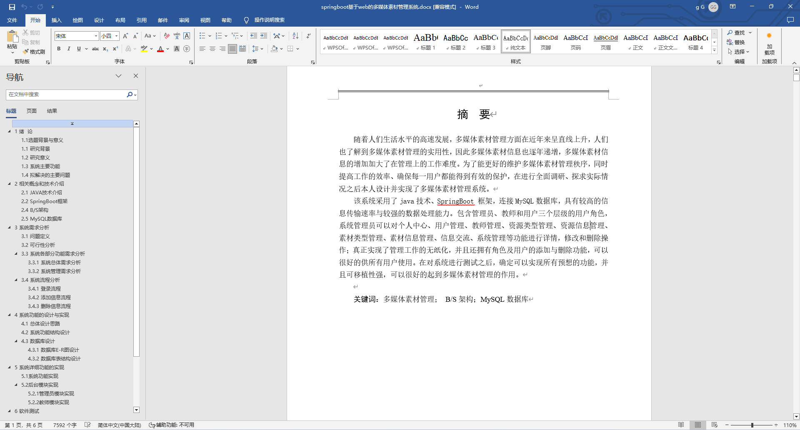
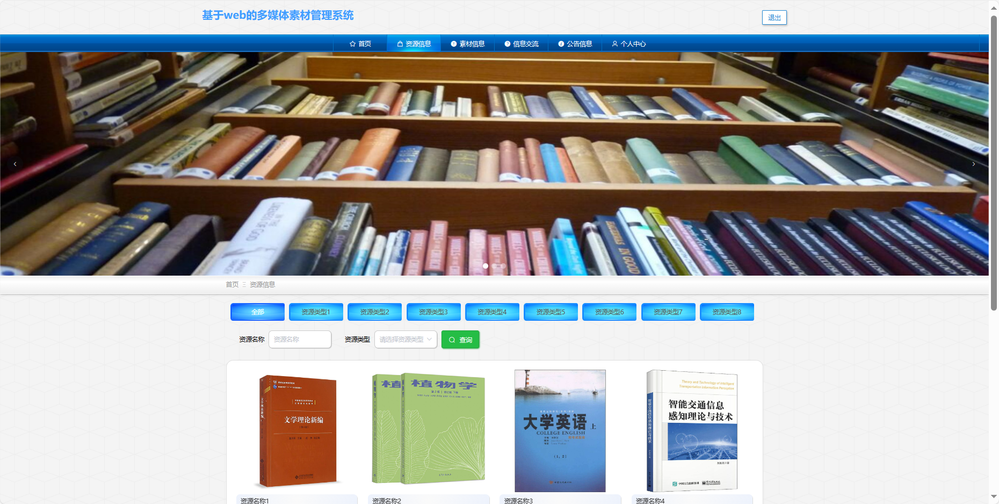
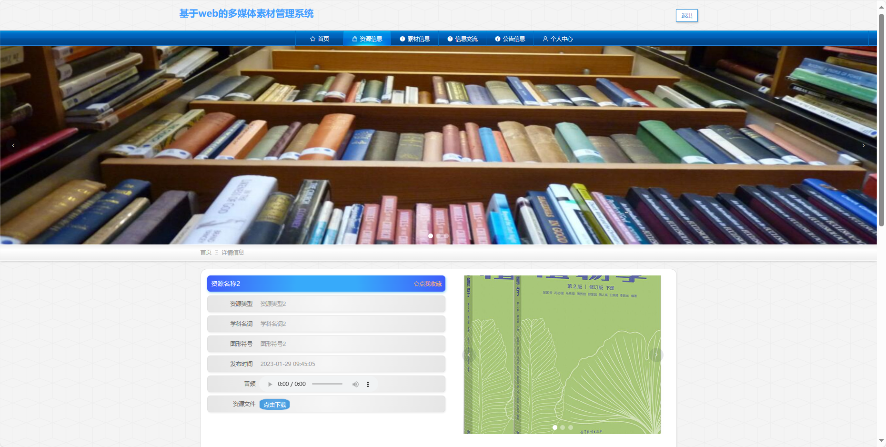
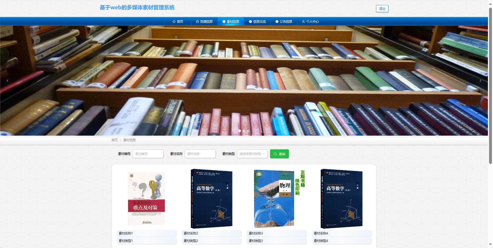
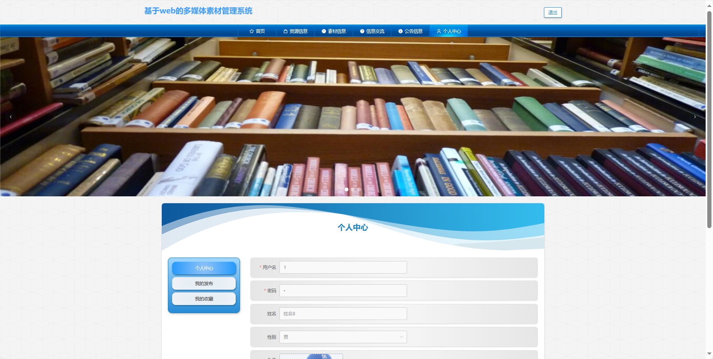
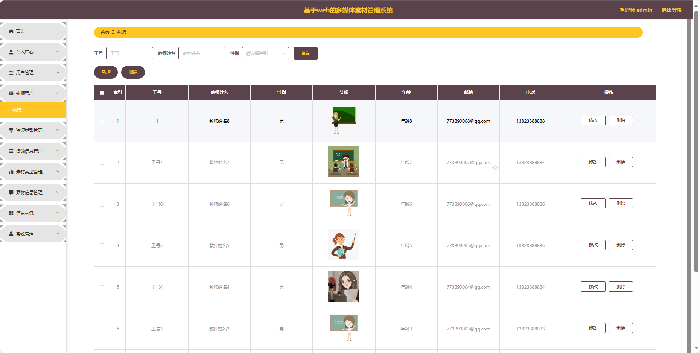
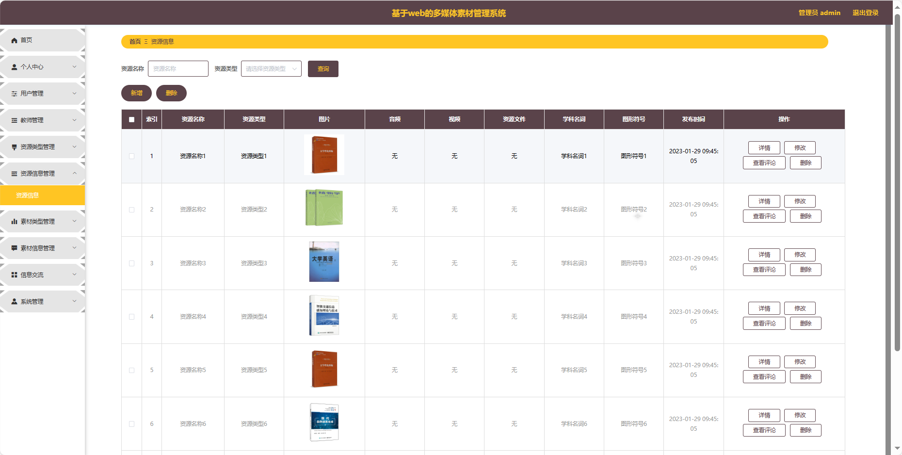

## 基于SpringBoot的多媒体素材管理系统(程序+报告)

- <b>完整代码获取地址：从戎源码网 ([https://armycodes.com/](https://armycodes.com/))</b>
- <b>技术探讨、资料分享，请加QQ群：692619798</b> 
- <b>作者微信：19941326836  QQ：952045282</b> 
- <b>承接计算机毕业设计、Java毕业设计、Python毕业设计、深度学习、机器学习</b>
- <b>选题+开题报告+任务书+程序定制+安装调试+论文+答辩ppt 一条龙服务</b>
- <b>所有选题地址 ([https://github.com/YuLin-Coder/AllProjectCatalog](https://github.com/YuLin-Coder/AllProjectCatalog)) </b>

## 项目介绍
基于SpringBoot的多媒体素材管理系统，系统包含三种角色：管理员、用户,教师主要功能如下。

### 【管理员】:
首页：查看系统整体。
个人中心：管理个人信息。
用户管理：审核和管理注册用户的信息。
教师管理：审核和管理注册教师的信息。
资源类型管理：管理系统中的资源分类信息。
资源信息管理：监管和管理系统中的资源信息。
素材类型管理：管理系统中的素材分类信息。
素材信息管理：监管和管理系统中的素材信。
信息交流：监管和管理用户间的交流内容。
系统管理：管理系统的基本设置和运行参数。

### 【教师】:
首页：查看系统的信息。
个人中心：管理个人信息。
资源信息管理：上传、管理教学资源信息。
素材信息管理：上传、管理多媒体素材。

### 【用户】:
首页：浏览系统的信息。
资源信息：查看系统中的各类资源信息。
素材信息：浏览系统中的多媒体素材。
信息交流：参与用户间的讨论和交流。
公告信息：查看系统发布的相关通知和公告。
个人中心：管理个人信息、查看历史记录等。

## 项目技术
- 编程语言：Java
- 数据库：MySQL
- 项目管理工具：Maven
- 前端技术：HTML、CSS、JavaScript、Jquery、Vue
- 后端技术：Spring、SpringMVC、MyBatis

## 运行环境
- JDK版本：JDK1.8及以上
- 开发工具：IDEA、Ecplise、Myecplise都可以
- 数据库: MySQL5.7及以上
- Maven：maven3.0及以上
- Node：14.14.0及以上

## 运行截图

